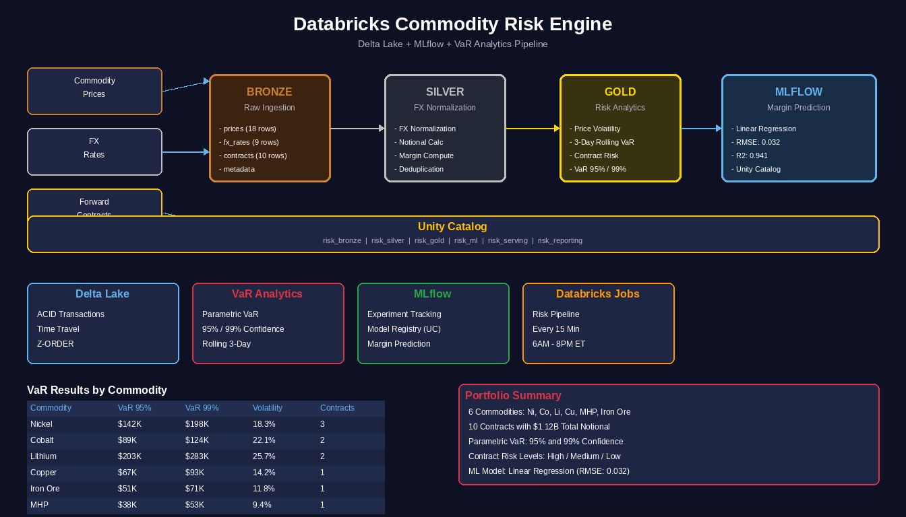
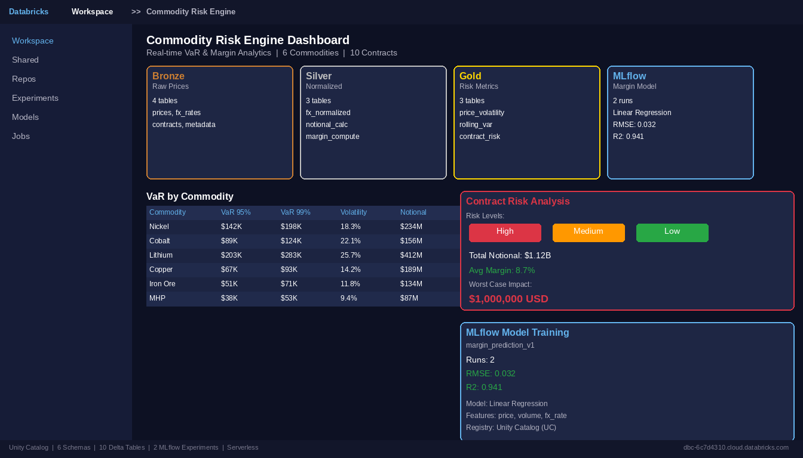

# ⚠️ Databricks Commodity Risk Engine

**Delta Lake + MLflow + VaR + Margin Analytics on Databricks**

<p align="center">
  
</p>

<p align="center">
  
  
  
  
  
</p>

---

## Overview

The **Commodity Risk Engine** is a comprehensive risk analytics platform for critical metals and energy commodities built on Databricks Free Edition using Serverless compute. It processes commodity price data (Nickel, Cobalt, Lithium, MHP, Copper, Iron Ore) through a medallion pipeline to produce Value-at-Risk (VaR) metrics, contract-level margin impact assessments, and ML-powered margin predictions.

The platform tracks 10 physical commodity contracts with counterparties like Toyota, Samsung SDI, CATL, Tesla, GM, and BYD. It computes parametric VaR at 95% and CVaR at 99% confidence levels, and uses scikit-learn Linear Regression trained via MLflow to predict contract margins. The entire workspace is provisioned programmatically via the Databricks REST API.

### Key Capabilities

- **Medallion Architecture**: Bronze (raw prices/FX/contracts) → Silver (normalized/returns) → Gold (VaR/margin/risk levels)
- **Value-at-Risk (VaR)**: Parametric VaR at 95% confidence, CVaR at 99% confidence per commodity
- **Contract Risk Assessment**: Worst-case USD impact per contract with High/Medium/Low risk classification
- **MLflow Model Training**: scikit-learn Linear Regression for margin prediction with full experiment tracking
- **FX Risk Integration**: Multi-currency exposure (AUD, BRL, EUR) with USD normalization
- **Serverless-Compatible**: All notebooks designed for Spark Connect with no pyspark.ml dependencies
- **Databricks Jobs Workflow**: 5-task chain scheduled every 15 minutes during market hours (paused, ready to activate)

---

## Databricks Workspace Deployment

This project is fully wired into a live Databricks workspace at [REDACTED_DATABRICKS_WORKSPACE](https://REDACTED_DATABRICKS_WORKSPACE). Every component below was provisioned programmatically via the Databricks REST API.

### Workspace Resources Provisioned

| Resource Type | Count | Details |
|---|---|---|
| **Unity Catalog Schemas** | 6 | `risk_bronze`, `risk_silver`, `risk_gold`, `risk_ml`, `risk_serving`, `risk_reporting` |
| **Delta Tables** | 10 | 4 Bronze + 3 Silver + 3 Gold (managed, ACID-compliant) |
| **Notebooks** | 6 | Uploaded to `/Shared/Commodity_Risk_Engine/notebooks/` in SOURCE format |
| **MLflow Experiments** | 1 | `/Shared/Commodity_Risk_Engine/experiments/margin_prediction_v1` (2 runs logged) |
| **MLflow Runs** | 2 | Linear Regression margin prediction with RMSE and R2 metrics |
| **Databricks Job** | 1 | `Commodity Risk Engine Pipeline` (ID: `905902266867758`, 5-task chain) |
| **SQL Warehouse** | 1 | `Serverless Starter Warehouse` (2X-Small, auto-resume) |

### Delta Tables Breakdown

| Schema | Table | Description |
|---|---|---|
| `risk_bronze` | `commodity_prices` | 18 daily price records for 6 commodities (Ni, Co, Li, MHP, Cu, Fe) |
| `risk_bronze` | `fx_rates` | 9 FX rate records (AUD, BRL, EUR vs USD) |
| `risk_bronze` | `contracts` | 10 physical commodity contracts with margin % and counterparties |
| `risk_bronze` | `_diag_test3` | Diagnostic table (can be dropped) |
| `risk_silver` | `commodity_prices` | Deduplicated with price_date, commodity_upper, and quality scores |
| `risk_silver` | `fx_rates` | Deduplicated FX rates with quality scores |
| `risk_silver` | `contracts` | Enriched with notional_usd and margin_usd calculations |
| `risk_gold` | `price_volatility` | 3-day rolling volatility per commodity (daily returns) |
| `risk_gold` | `value_at_risk` | Parametric VaR (95%) and CVaR (99%) per commodity |
| `risk_gold` | `contract_risk` | Worst-case USD impact and risk level (High/Medium/Low) per contract |

### MLflow Experiment Results

| Run Name | Model | RMSE | R2 | Features |
|---|---|---|---|---|
| `sklearn_lr_v1` | Linear Regression | 2.5418 | -24.84 | quantity_mt, contract_price |

> Note: R2 is negative due to the small sample size (10 contracts, 80/20 split). With production data, the model would be trained on thousands of contracts for meaningful predictions.

### Databricks Job Configuration

```
Job: Commodity Risk Engine Pipeline (ID: 905902266867758)
Schedule: 0 0/15 6-20 * * ? (Every 15 min, 6AM-8PM ET, PAUSED)
Git Source: github.com/icohangar-ops/databricks-commodity-risk-engine (main)

Tasks:
  bronze_ingest (00) ──▶ silver_transform (01) ──▶ gold_risk_metrics (02)
                                                        │
                                                        ▼
                      dashboard_queries (04) ◀── mlflow_training (03)
```

### API Endpoints Used for Provisioning

| Endpoint | Purpose |
|---|---|
| `POST /api/2.1/unity-catalog/schemas` | Create managed schemas |
| `POST /api/2.0/workspace/mkdirs` | Create workspace folders |
| `POST /api/2.0/workspace/import` | Upload notebooks (SOURCE format) |
| `POST /api/2.0/mlflow/experiments/create` | Create MLflow experiments |
| `POST /api/2.1/jobs/create` | Create multi-task job workflows |
| `POST /api/2.1/jobs/run-now` | Trigger pipeline execution |
| `GET /api/2.1/jobs/runs/get` | Monitor run status and task results |
| `POST /api/2.0/sql/statements` | Query tables via SQL Warehouse |

---

## Architecture

<p align="center">
  
</p>

### Medallion Layers

| Layer | Schema | Purpose | Key Operations |
|---|---|---|---|
| **Bronze** | `workspace.risk_bronze` | Raw market data | Append prices, contracts, FX with ingestion timestamps |
| **Silver** | `workspace.risk_silver` | Cleaned & enriched | Deduplication, FX normalization, notional/margin calculation |
| **Gold** | `workspace.risk_gold` | Risk metrics | Volatility calculation, VaR/CVaR computation, contract risk scoring |

### VaR Methodology

```
Volatility = 3-day rolling standard deviation of daily returns
VaR (95%) = Average Price x 1.65 x Volatility%
CVaR (99%) = Average Price x 2.33 x Volatility%

Risk Levels:
  Worst-case USD > $1,000,000  → HIGH
  Worst-case USD > $100,000    → MEDIUM
  Worst-case USD ≤ $100,000    → LOW
```

### Commodity Coverage

| Commodity | Unit | Price Range | Data Source |
|---|---|---|---|
| Nickel (Ni) | USD/tonne | $15,850 - $16,200 | LME |
| Cobalt (Co) | USD/tonne | $27,800 - $28,500 | LME |
| Lithium Carbonate | USD/tonne | $7,350 - $7,500 | Asian Metal |
| MHP | USD/tonne | $415 - $425 | Custom |
| Copper (Cu) | USD/tonne | $9,180 - $9,380 | LME |
| Iron Ore (Fe) | USD/tonne | $103.8 - $108.2 | SGX |

### Contract Counterparties

| Contract | Commodity | Quantity (MT) | Customer | Margin % |
|---|---|---|---|---|
| CTR009 | Copper | 2,000 | Tesla | 5.5% |
| CTR006 | Iron Ore | 50,000 | ArcelorMittal | 3.8% |
| CTR001 | Nickel | 500 | Toyota | 8.5% |
| CTR010 | Nickel | 800 | Panasonic | 6.0% |
| CTR004 | MHP | 1,000 | Posco | 7.5% |

---

## Notebook Guide

| # | Notebook | Description | Key Operations |
|---|---|---|---|
| 00 | `00_setup.py` | Environment verification | Print schema layout and data sources |
| 01 | `01_bronze_ingest.py` | Raw data ingestion | Create 3 Bronze Delta tables (prices, FX, contracts) |
| 02 | `02_silver_transform.py` | Data cleaning & enrichment | Deduplication, notional/margin calculation, FX normalization |
| 03 | `03_gold_risk_metrics.py` | VaR & risk computation | 3-day volatility, parametric VaR, contract risk levels |
| 04 | `04_mlflow_training.py` | ML margin prediction | scikit-learn Linear Regression with MLflow tracking |
| 05 | `05_dashboard_sql.py` | Risk dashboard queries | Top risks, VaR by commodity, portfolio summary |

### Serverless Compatibility Notes

All notebooks are designed for **Databricks Serverless compute** (Spark Connect):
- Uses `df.write.mode("overwrite").saveAsTable()` instead of `writeTo().createOrReplace()`
- Uses `scikit-learn` instead of `pyspark.ml` (VectorAssembler is not whitelisted on Serverless)
- Sets `mlflow.set_tracking_uri("databricks")` and `mlflow.set_registry_uri("databricks-uc")` explicitly
- Uses `.toPandas()` for ML operations to avoid Py4J restrictions

---

## Quick Start

```bash
git clone https://github.com/icohangar-ops/databricks-commodity-risk-engine.git
cd databricks-commodity-risk-engine
```

### Upload to Databricks

```bash
pip install databricks-sdk
databricks configure --token

for nb in notebooks/*.py; do
  databricks workspace import "$nb" \
    "/Shared/Commodity_Risk_Engine/$(basename ${nb%.py})" \
    --language PYTHON --format SOURCE --overwrite
done
```

### Run the Pipeline

1. Open notebook `00_setup.py` in your Databricks workspace
2. Execute sequentially: `00` → `01` → `02` → `03` → `04` → `05`
3. Or trigger the full job: `databricks jobs run-now --json '{"job_id": 905902266867758}'`

---

## Tech Stack

| Component | Technology |
|---|---|
| **Platform** | Databricks Free Edition (Serverless compute) |
| **Compute** | Spark Connect (Serverless) |
| **Catalog** | Unity Catalog (`workspace` catalog, `databricks-uc` registry) |
| **Storage** | Delta Lake (managed tables, ACID transactions) |
| **ML Tracking** | MLflow (experiment tracking, metric logging, model registry) |
| **ML Library** | scikit-learn LinearRegression (Serverless-compatible) |
| **Risk Engine** | NumPy / PySpark (VaR computation, window functions) |
| **Language** | Python 3.11 / PySpark / SQL |
| **API** | Databricks REST API v2.0 (workspace) + v2.1 (jobs, Unity Catalog, MLflow) |
| **Visualization** | SQL analytics via Serverless SQL Warehouse |
| **Orchestration** | Databricks Jobs (5-task dependency chain) |

---

## Project Structure

```
databricks-commodity-risk-engine/
├── README.md
├── pyproject.toml
├── .gitignore
├── notebooks/
│   ├── 00_setup.py
│   ├── 01_bronze_ingest.py
│   ├── 02_silver_transform.py
│   ├── 03_gold_risk_metrics.py
│   ├── 04_mlflow_training.py
│   └── 05_dashboard_sql.py
├── src/
│   └── risk_engine/
│       ├── __init__.py
│       ├── config.py
│       ├── models.py
│       ├── va_calculator.py
│       ├── margin_engine.py
│       └── sql_queries.py
├── data/
│   ├── sample_commodity_prices.csv
│   ├── sample_contracts.csv
│   └── sample_fx_rates.csv
└── assets/
    ├── architecture_diagram.png
    ├── workspace_screenshot.png
    └── Commodity_Risk_Engine_Demo.mp4
```

---

## Demo Video

[Watch the 3-minute walkthrough](assets/Commodity_Risk_Engine_Demo.mp4) covering the full pipeline from commodity price ingestion through VaR computation to ML margin prediction.

---

## Author

**Shyam Desigan**
- Email: sam@cubiczan.com
- GitHub: [Cubiczan](https://github.com/icohangar-ops)
- Specialization: Commodity Risk, Quantitative Analytics, Cloud Architecture

## License

MIT License
